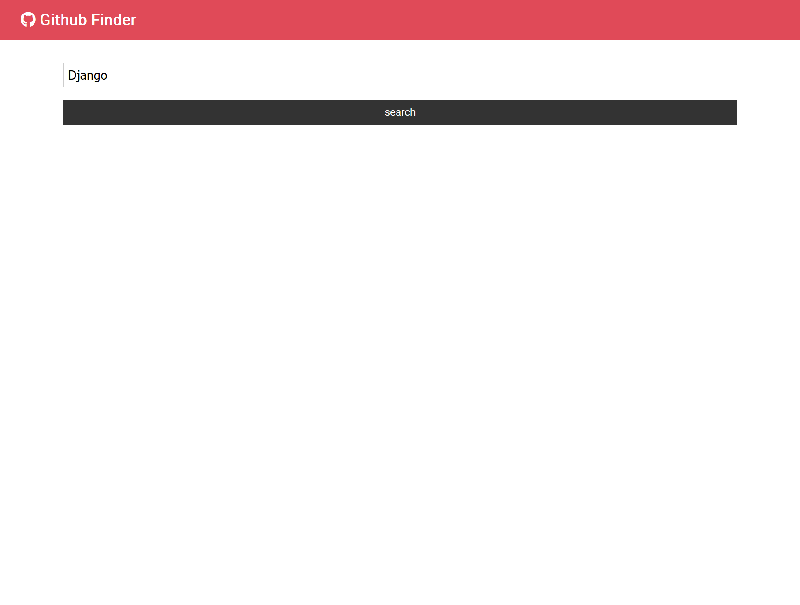

<h1>Using Reactjs to build, netlify to deploy, and Traversy to guide I have built this Github finder. </h1>

<a href = "https://djangosgithubfinder.netlify.app/">Full Site</a>

<h2>Users can enter a name into the search bar </h2>

<h2>The app will make a request to the github API for users with or related to that name.</h2>

<h2>Then the user can click on a profile to view their latest 5 repositories, username, website, activities,  as well as find a link to the selected users github profile. </h2>

